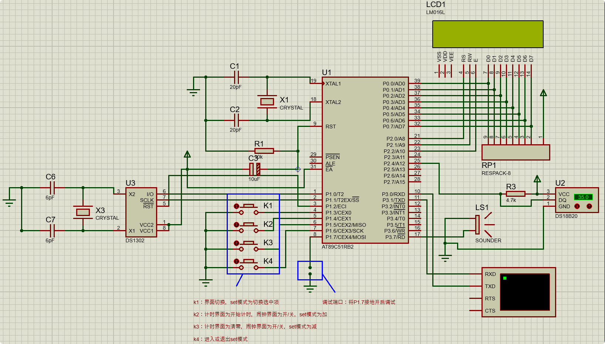

# Timer-Proteus-C51

下载 `.pdsprj` 文件后用Proteus 8.17及以上打开即可。仿真电路与代码均已包含在该文件中。

使用 LCD1602、DS18b20、DS1302，包含时钟、计时、闹钟、温度界面，支持设定时间、开关闹钟和切换温标。

#### 吐槽

本想结合TRAE做Proteus开发工作流，但低估了画电路图和电路调试的自动化难度，最后还是手动完成电路之类。

直接生成导入电路文件的方案会卡在调试和观察调试结果上，应该研究下视觉……不过暂时算了，有别的在研究。

